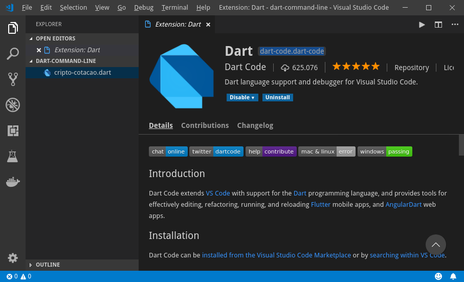
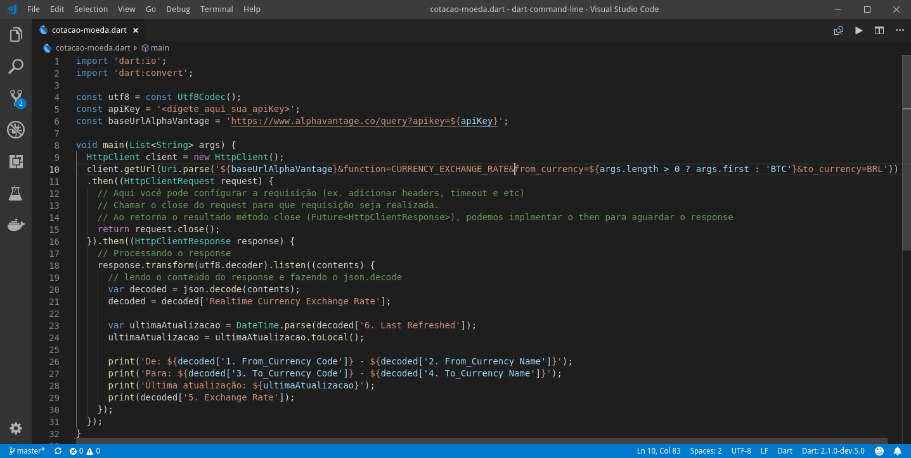

# Dart em linha de comando

Quando nos referimos a linha de comando, é porque normalmente usamos o aplicativo para rodar algum processamento momentâneo ao executarmos a partir de um terminal (ex. bash, zsh e sh no Linux ou DOS ou PowerShel no Windows). Ele também pode ser executado em modo deamon como um serviço na máquina ou como um serviço agendado sendo executado por um acionador tipo crontab.

Vamos implementar um aplicativo de exemplo bem simples que exibe a cotação de moedas, justamente pra mostrar que também é possível acessar recursos externos nestes tipos de aplicativos.

***Lembre-se***: Este código é só pra exemplificar o uso do Dart em aplicações em command-line, se você não entender o código fique tranquilo pois nas próximas postagens vamos detalhar o uso das APIs do Dart.

## Criação dos diretório e projeto Dart

Seguindo a estrutura de diretórios que convencionamos, vou criar o diretório abaixo para que vocês possam acompanhar o desenvolvimento.

    mkdir -p ~/desenv/projects/
    cd ~/desenv/projects/
    mkdir -p estudos/dart/exemplos
    cd estudos/dart/exemplos

    #Criação do diretório principal do projeto
    mkdir dart-command-line
    cd dart-command-line

    #Criação do main do dart (aquivo que contém a function de bootstrap da aplicação)
    touch cotacao-moeda.dart 

## API que informa a cotação em tempo real para servir de fonte de dados para nosso programa.

Através de um breve "googlada" encontrei o projeto **AlphaVantage** que oferece um serviço free de cotação de moedas (não sei se é a melhor, mas vai servir para o nosso exemplo).

Bom, e para acessar a api eu tive que criar uma chave de acesso que deve ser passada em cada requisição. Essa chave serve apenas para que o serviço identifique quem está fazendo as requisições.

Crie sua chave acessando o link https://www.alphavantage.co/support/#api-key. Logo após o submit do formulário você receberá uma chave parecida com essa aqui ***FB9HJESAWGT7YDH6***.

Se quiser consultar a documentação da API, segue os links: 

https://www.alphavantage.co/documentation/

https://www.alphavantage.co/documentation/#digital-currency

## Escolhendo nosso Editor

Use seu editor preferido para escrever seu código, mas nesse exemplo usarei o VSCode. Então antes de abri o VSCode com o código, vou instalar um plugin do Dart para facilitar as coisas.

Isso vai nos permitir fazer autocomplete e localização dos pacotes a ser importado no código.

    $ code --install-extension dart-code.dart-code
    $ code --install-extension formulahendry.code-runner # Para execução do código através do comando Ctrl+Alt+N
    $ cd /home/hendi/desenv/projects/estudos/dart/dart-command-line
    $ code .

[Imagem 01] VSCode com o plugin do Dart

## Escrevendo nosso primeiro código

Para quem tem familiaridade com a sintaxe do Java e TypeScript, não vai ter muita dificuldade de adaptação, e como já estou desenvolvendo Java há uns 17 anos e com Angular há 2 anos não senti muito dificuldade de início. 

Lembrando que apesar da familiaridade de sintaxe com o Java e TypeScript, o Dart é uma linguagem de script. Ela é interpretada e não como o Java que é compilada.

No Java, compilamos o código fonte .java para um bytecode .class (através do compilador javac) para ser interpretado pela VM java (comando ***java*** ou ***javaw***).

No Dart o arquivo .dart não precisa passar por um compilador e é interpretada diretamente pela VM do Dart (comando ***dart***).

Este é o menor código executável em Dart. O famoso 'Hello, World!'.

    void main() {
        print('Hello, World!');
    }

E nosso primeiro código ficou assim:

E ao digitar o comando 'dart cotacao-moeda.dart', veja o resultado. Como padrão a moeda a ser convertida para o real é a cripto moeda Bitcoin.

    $ dart cotacao-moeda.dart
    De: BTC - Bitcoin
    Para: BRL - Brazilian Real
    Última atualização: 2018-09-30 03:08:17.000
    26586.83954400

Mas se você passar o parâmetro <código da moeda>, a conversão se dará a partir desta moeda.

    $ dart cotacao-moeda.dart USD
    De: USD - United States Dollar
    Para: BRL - Brazilian Real
    Última atualização: 2018-09-30 03:07:07.000
    4.03840000

Rapaz, fiquei impressionado com a conversão para Iene!

    $ dart cotacao-moeda.dart JPY
    De: JPY - Japanese Yen
    Para: BRL - Brazilian Real
    Última atualização: 2018-09-30 03:09:04.000
    0.03550000

O formato a data está em UTC, ou seja, três horas a mais da nossa que é GMT-3 e o formato da moeda é americano! Isso que não achei tão legal na linguagem, formatação de data e moeda e feito através de outra lib que você precisa baixar ou fazer na 'big hand'!

Bom, mais isso já dá uma ideia de como você pode usar o Dart para fazer aplicações e rodar em linha de comando, seja por chamada de usuário, agendamento cron ou com um serviço deamon para fazer determinadas tarefas do seu dia a dia.

Este exemplo pode ser baixado através do comando abaixo:

    $ git clone git@github.com:Flutter-DevApps/Exemplos.git

Até mais meus caros e não deixe de fazer um [tour](https://www.dartlang.org/guides/language/language-tour) pela linguaguem!