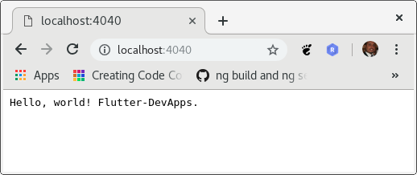
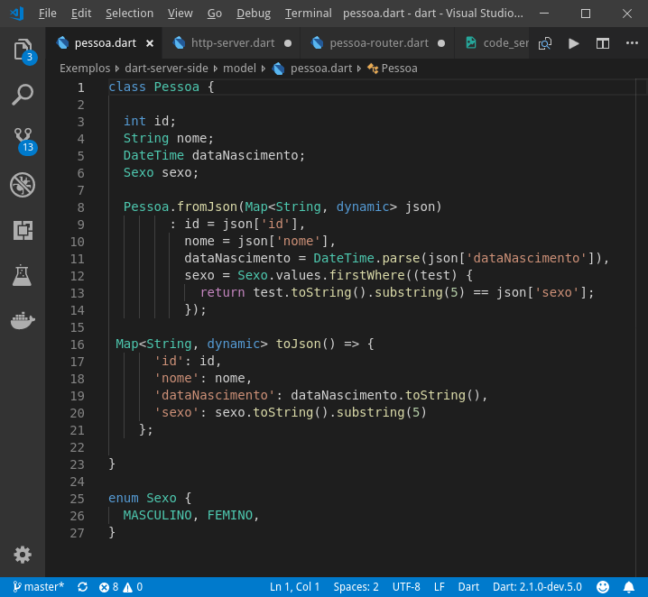
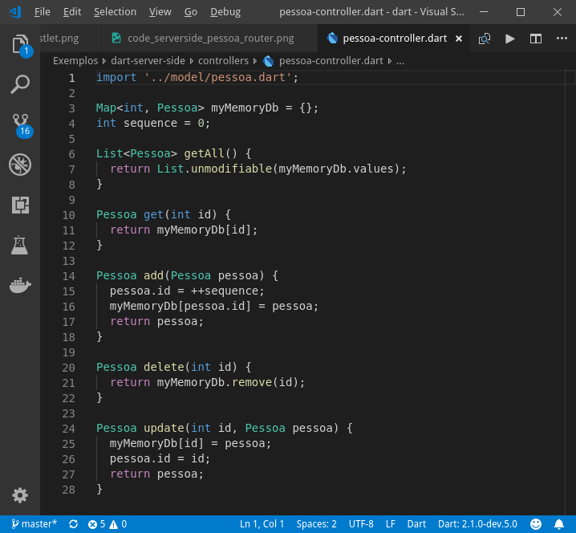
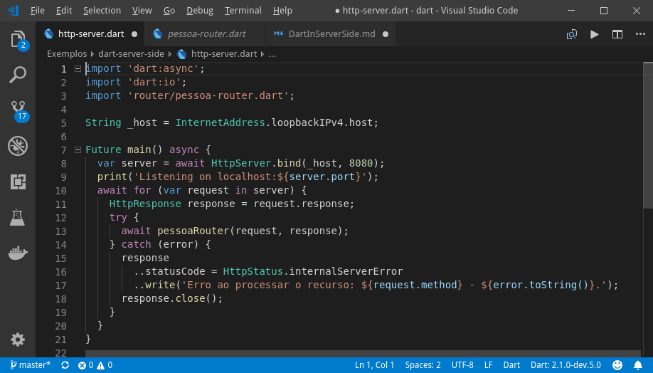
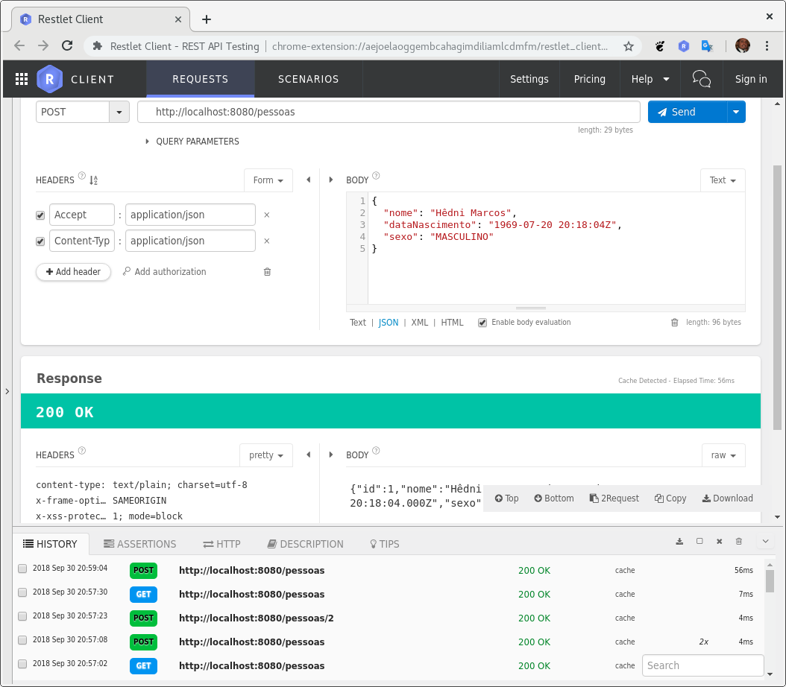
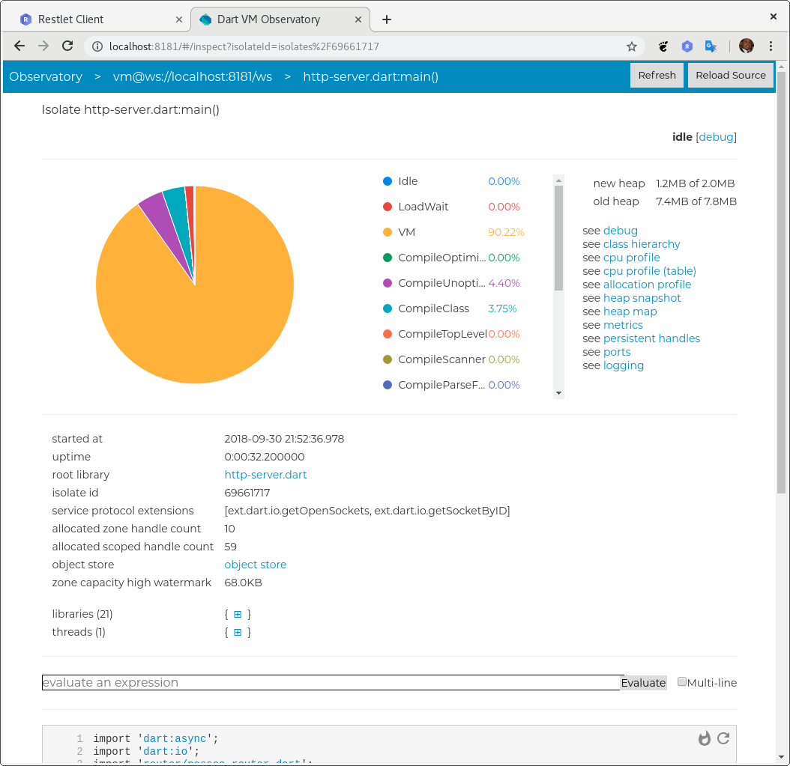

# Dart em linha de comando

Olá Galera do Flutter-DevApps, hoje vamos complicar um pouco as coisas neste exemplo. ¯\_(ツ)_/¯

Assim como o exemplo do command-line, não vou entrar em detalhes do uso da APIs e nem dos estilos de programação utilizada no Dart. Claro que podemos pontuar algumas coisas pra vocês não ficarem viajando muito e acabar se desinteressando em continuar nos estudos.

Pra começar, recomendo fortemente a leitura dos links abaixo sobre Future, Stream e programação reativa:

## Uma breve explicação sobre programação Reativa

Mas porque vamos falar sobre programação reativa neste simples exemplo de aplicação Server-Side?

Isso porque, assim como o JavaScript, o Dart é uma linguagem de programação single-threaded. Se algum código bloquear o encadeamento de execução (por exemplo, executando um cálculo ou bloqueio de longa execução na E/S), o programa congelará.

Nestes tipos de linguaguem as operações assíncronas permitem que o seu programa conclua outro trabalho enquanto aguarda a conclusão de uma outra operação.

E quando criamos uma aplicação Server-Side que vai ficar escultando requisições em uma porta no servidor, precisamos que ele atenda a múltiplas requisições dos clientes, e isso no Java seria resolvido facilmente com a utilização de [Threads](https://pt.wikipedia.org/wiki/Thread_(computa%C3%A7%C3%A3o)) (precessamento em paralelo à thread principal da aplicação). Mas no JavaScript ou no Dart as requisições são tratadas de forma serial (uma após a outra) por não ter como abrir multiplas threads, e para amenizar esse problema o estilo de programação Reativa nos ajuda a ficar delegando as funções de [callback](https://en.wikipedia.org/wiki/Callback_(computer_programming)) os resultados das operações assim que elas estiverem prontas (isso se aplica também a requisições http, acesso a bancos de dados, ou qualquer outra api que implemente este estilo).

E no Dart temos duas classes nativas que nos ajudam no tratamento de programação reativa, são elas (existem outras por trás, mas são elas as principais):

- Future - https://api.dartlang.org/stable/2.0.0/dart-async/Future-class.html

Um objeto que representa um cálculo atrasado. Para que trabalha com JavaScript para fazer uma associação com a class Promise.
 
Um Future é usado para representar um valor em potencial ou um erro, que estará disponível em algum momento no futuro. Os receptores de um Future podem se registrar para receber os dados de retorno da chamada e com isso manipular o valor ou o erro que venha a ocorrer, assim que estiverem disponíveis. 

- Stream - https://api.dartlang.org/stable/2.0.0/dart-async/Stream-class.html

Uma fonte de eventos de dados assíncronos. Para que trabalha com JavaScript para fazer uma associação com a class Observable (do projeto [ReactiveX](http://reactivex.io/) que tem uma implementação para JavaScript chamada [RxJs](https://github.com/ReactiveX/rxjs)).

Um Stream fornece uma maneira de receber uma sequência de eventos. Cada evento é um evento de dados, também chamado de elemento do Stream, ou um evento de erro, que é uma notificação de que algo falhou. Quando um Stream tiver emitido todo o seu evento, um único evento "concluído" notificará o ouvinte que o fim foi atingido.

É um estilo de programação que está sendo muito utilizado ultimamente por trazer uma série de benefícios. Seguem os pilares da programação reativa:

    - Elástico: Reage à demanda/carga: aplicações podem fazer uso de múltiplos núcleos e múltiplos servidores;
    - Resiliente: Reage às falhas; aplicações reagem e se recuperam de falhas de software, hardware e de conectividade;
    - Message Driven: Reage aos eventos (event driven): em vez de compor aplicações por múltiplas threads síncronas, sistemas são compostos de gerenciadores de eventos assíncronos e não bloqueantes;
    - Responsivo: Reage aos usuários: aplicações que oferecem interações ricas e “tempo real” com usuários.

Existem implementações do [ReactiveX](http://reactivex.io/) para várias linguagens (veja a lista completa [aqui](http://reactivex.io/languages.html)), e inclusive para o próprio Dart que é o [rxdart](https://github.com/ReactiveX/rxdart). Porém a classe Stream já é uma espécie de Observable, mas sem todas os recurso da especificação ReactiveX, e na verdade a Classe Observable do [rxdart](https://github.com/ReactiveX/rxdart) estende a classe Stream do Dart para dar suporte aos demais recursos.

Vejam este post interessante que fala sobre programação reativa https://medium.com/olxbr-tech/por-que-programa%C3%A7%C3%A3o-reativa-8fba7e754a0f

Existem dois tutoriais que merecem sua atenção sobre Futures e Stream no próprio site do Dart. Leia e pratique os exemplos que dos dois link abaixo.

- [Tutorial sobre Future](https://www.dartlang.org/tutorials/language/futures)
- [Tutorial sobre Stream](https://www.dartlang.org/tutorials/language/streams)

## Criação dos diretório e projeto Dart

Seguindo a estrutura de diretórios que convencionamos, vou criar o diretório abaixo para que vocês possam acompanhar o desenvolvimento.

    mkdir -p ~/desenv/projects/
    cd ~/desenv/projects/
    mkdir -p estudos/dart/exemplos
    cd estudos/dart/exemplos

    #Criação do diretório principal do projeto
    mkdir dart-server-side
    cd dart-server-side

    #Criação do main do dart (aquivo que contém a function de bootstrap da aplicação)
    touch http-server.dart 

## Menor código de Server-Side

Apresento pra vocẽs o menor código server-side em Dart, o famoso "Hello, World". Vou criar o arquivo dart server-hello-world.dart com este exemplo.

    import 'dart:io';

    void main() async {
        //Criação de um HttpServer que vai atender na ip/porta localhost:4040
        var server = await HttpServer.bind(
            InternetAddress.loopbackIPv4,
            4040,
        );
        print('Listening on localhost:${server.port}');

        server.listen((request) {
            request.response.write('Hello, world! Flutter-DevApps.');
            request.response.close();
        });
    }

A class HttpServer do Dart é uma extensão da class Stream que recebe eventos de HttpRequest.

abstract class HttpServer implements Stream<HttpRequest>

E toda classe que estende de Stream precisa implemantar o método listen, esse método que deve iniciar o Stream e receber uma função de Callback que irá tratar as requisições e consequentemente devolver uma resposta para cada. E é justamente isso que o trecho abaixo está fazendo.

    server.listen((request) {
        request.response.write('Hello, world!');
        request.response.close();
    });

Agora execute o comando 'dart server-hello-world.dart' e logo em seguida acesse um browser e digite a URL http://localhost:4040.

[Imagem 01] - Resultado do Hello World Server-Side.

Observem que se colocarmos um print logo após a chamada do listen ele é exibido, mas porque o programa não termina se o método main chegou ao fim e continua respondendo as requisições no browser?

    server.listen((request) {
        request.response.write('Hello, world!');
        request.response.close();
    });

    print('Término do método main!');

Chamada do programa.

    $ dart server-hello-world.dart
    Listening on localhost:4040
    Término do método main!

Esse é um dos **cuidados** ao usar os Stream e Observable no Dart, assim como no JavaScript. Se vpcê deixa um Stream aberto ele não deixa que a VM do Dart termine pois fica um Stream sendo processado na VM com sua respectiva função de callback. 

Em muito caso isso pode dar problemas de [memory leak](https://pt.wikipedia.org/wiki/Vazamento_de_mem%C3%B3ria) em sua aplicação! A criação de muitos Stream sem ter o cuidado de encerrá-los no momento certo.

Mas não se preocupe com isso neste exemplo, pois é justamente a nossa intenção! Deixar sempre o serviço no ar.

Se quisermos encerrar uma Stream, temos que cancelar a subscrição. E fazemos isso como no exemplo de código abaixo.

    var streamSubscription = server.listen((request) {
        request.response.write('Hello, world! Flutter-DevApps.');
        request.response.close();
    });

    print('Término do método main!');
    streamSubscription.cancel();

Uma forma mais elegante de implementar esse trecho é a forma abaixo:

    await for (HttpRequest request in server) {
        request.response
            ..write('Hello, world! Flutter-DevApps.')
            ..close();
    }

É como o for chamasse o listen do server, e a cada requisição o request é passado para a iteração do for. 

Outra observação é a utilização de [Method Cascading](https://en.wikipedia.org/wiki/Method_cascading) na construção do response (veja mais em https://en.wikipedia.org/wiki/Fluent_interface e https://en.wikipedia.org/wiki/Method_chaining).

**Que lindo! (♥.♥)** 

## Criando nosso programa Server-Side

Nosso exemplo será de um CRUD da entidade Pessoa, mas por enquanto não vamos fazer acesso a banco de dado. Todos os dados serão armazenados em memória.

Numa outra oportunidade abordaremos a persistência em banco, mas o objetivo agora é mostrar apenas como funciona uma aplicação Server-Side simples.

### Entidade Pessoa

A classe pessoa ficou com 4 (quatro) atributo, um de cada tipo de dado.

### A funcão Controller de Pessoa

A function controller, que deveria conter as regras de negócio da entidade Pessoa ficou apenas com o papel de armazenar as entidades na memória.

### A funcão Router de Pessoa

A function router ficou responsável por tratar as requisições (HttpRequest) e delegando ao controller e escrever as respostas (HttpResponse) com os dados obtidos do também do controller.

### A funcão Main Server

Responsável por inicia o serviço na porta 8080 e delegar as requisições (HttpRequest) para a function Router.

## Iniciando e testando nossa aplicação

Para iniciar a aplicação utilizamos o executável que é interpretador e VM do Dart.

    $ dart http-server.dart
    Listening on localhost:8080

E para testar eu usei o plugin do Google Chrome chamdado Restlet

## Conclusão 

Bom, acho que o objetivo deste post com cumprido e deu pra demonstrar de forma simples como implementar um serviço Rest usando o Dart.

Usei apenas as APIs que vem com o SDK do Dart, e por isso precisei criar umas coisas na 'big hand'! Por exemplo, se eu fosse realmente criar um API Rest para colocar em produção eu usaria uma API especialista para isso e facilitaria minha vida na criação das rotas como o projeto [Aqueduct - https://aqueduct.io/](https://aqueduct.io/docs/tut/getting-started/). 

O legal deste projeto da Aqueduct também tem uma API de persistencia de dados ORM usando Postgres [Aqueduct ORM](https://aqueduct.io/docs/getting_started/#using-the-aqueduct-orm)

Fica mais uma curiosidade pra vocês, iniciem o servidor com a linha de comando abaixo.

    dart --observe http-server.dart

O parâmetro --observe inicia um servidor na porta padrão 8181 que você pode monitorar a VM e tudo que está rodando nela. Mas só foi uma dica para vocês irem fuçando, pois farei um post sobre o Observe mais pra frente!

Este exemplo pode ser baixado através do comando abaixo:

    $ git clone git@github.com:Flutter-DevApps/Exemplos.git

E não esqueçam de dar uma lida no [tutorial do httpserver](https://www.dartlang.org/tutorials/dart-vm/httpserver) do Dart!

Bye, e até a próxima!
