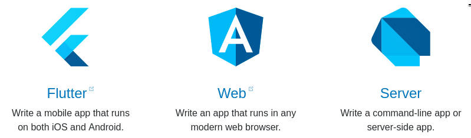

# Onde o Dart pode atuar?

Tudo bem galera do Flutter-DevApps?!

Hoje vou mostrar como o Dart funciona. Cheguei até a mostrar resumidamente em quais as plataformas podemos rodar aplicações feitas em Dart e também o que compõe o seu SDK na última postagem (ver o conteúdo do link [02_Install_Dart](../02_Install_Dart/README.md)), porém vamos tentar mostrar mais alguns detalhes aqui.

[Imagen 01] - Plataformas onde podemos rodar aplicações escritas em Dart.

Bom, só olhando para a imagem acima você já pode notar que aprendendo Dart você pode se tornar um desenvolvedor fullstack (diferente de muitas linguagem de mercado), ou seja:

- Pode atuar em aplicações escritas para rodar em linha de comando (tipo script ou processamento batch mais rebuscadas) ou server-side processando requisições nos mais diversos tipos de protocolos (HTTP, HTTPS, WebSocket e etc). Podendo também se comunicar com banco de dados tradicionais e/ou NoSQL, Mensageria, FileSystem e outros;

- Aplicações Web que rodam nos diversos Browsers parecendo JavaScript, onde é importado uma engine no formato de biblioteca que interpreta o código Dart ou podemos simplesmente converter nosso código Dart para JavaScript (o qual os Browser já possuem seus interpretadores nativos) usando umas das ferramentas do SDK;  REVER

- Fazer aplicações para rodar nos celulares Android e IOS, gerando códigos nativos para as duas plataformas com excelente qualidade e performance.

- E quem sabe até aplicações Desktop com ajuda do [Electron](https://electronjs.org/) que dá suporte a aplicações Web rodarem como se fosse aplicações desktop fornecendo APIs que se comunicam com o SO hospedeiro ou através projeto da Google (porém sem suporte oficial e também não pertencente a equipe do Flutter) [flutter-desktop-embedding](https://github.com/google/flutter-desktop-embedding) em conjunto com o projeto [Custom Flutter Engine-Embedders](https://github.com/flutter/engine/wiki/Custom-Flutter-Engine-Embedders) que oferece aos desenvolvedores uma série de API e ferramentas para que possamos criar nossos próprios adaptadores para quaisquer ambientes que não seja Android ou IOS (pois esse já são desenvolvidos pela equipe do Flutter).

**Vale lembrar** que ser um desenvolvedor fullstack não é apenas isso! O cabra tem que ter atitude, conhecer muito de tecnologia e de arquitetura de aplicações, desenrolar bem usando outras ferramentas relacionadas ao desenvolvimento de software tipo Docker, Cloud, Monitoração de aplicações, Performance, etc etc etc e os cambaus! **{{{(>_<)}}}**

E não tem como falar sobre as Plataformas e VM do Dart sem entra no detalhe do que compõe a SDK. Se você viu a última postagem ou seguiu o link acima, notou que o SDK tem dois diretórios principais: 

- **lib**: Contém todas as bibliotecas do Dart nativas do Dart para as principais classes como int, double, bool, String, List, Set, Random... e funções com min, max, pow, sqrt e por aí vaí! Essas abaixo são as mais comuns...

        ls -la $DART_HOME/lib
        drwxr-xr-x  2 hendi hendi  4096 set 19 14:38 async
        drwxr-xr-x  2 hendi hendi  4096 set  7 12:07 collection
        drwxr-xr-x  2 hendi hendi  4096 set 19 14:38 core
        drwxr-xr-x  2 hendi hendi  4096 set 19 14:38 io
        drwxr-xr-x  3 hendi hendi  4096 mai  9 05:26 js
        drwxr-xr-x  2 hendi hendi  4096 jul 23 12:15 math
        ...

Não vamos entrar no detalhes de cadas lib, o importante agora é saber onde ficam e para que serve. Se quiser consultar cada uma delas agora segue siga o link [Dart Libraries](https://docs.flutter.io/index.html). Mas não se "aperrei" agora, vamos com calma... vamos tratar disso mais pra frente e aprendendo juntos! ;)

- **bin**: E aqui temos a VM para rodar as aplicações em Dart via linha de comando ou iniciando um servidor e outras ferramentas.

        $ ls $DART_HOME/bin

        dart - A VM standalone (runtime)
        dart2js - O compilador Dart para JavaScript (usado apenas para o desenvolvimento para web browsers)
        dartanalyzer - O analizador estático de código
        dartdevc - O compilador Dart para geração de módulos JavaScript (amd, common ou es6) (usado apenas para o desenvolvimento para web browsers)
        dartdoc - Gerador de documentantação de API
        dartfmt - Formatador de código Dart
        pub - O gerenciador de pacotes Dart

Para este documento não ficar muito extenso e cansativo para a gente, irei criar 5 arquivos contendo alguns detalhes de cadas uma das plataformas:

- [Dart na linha de comando](DartInCommandLine.md)

- [Dart no servidor](DartInServerSide.md)

- [Dart na Web](DartInWeb.md)

- [Dart no celular](DartWithFlutter.md)

- [Dart no desktop](DartInDesktop.md)

*Boa leitura e até a próxima!*